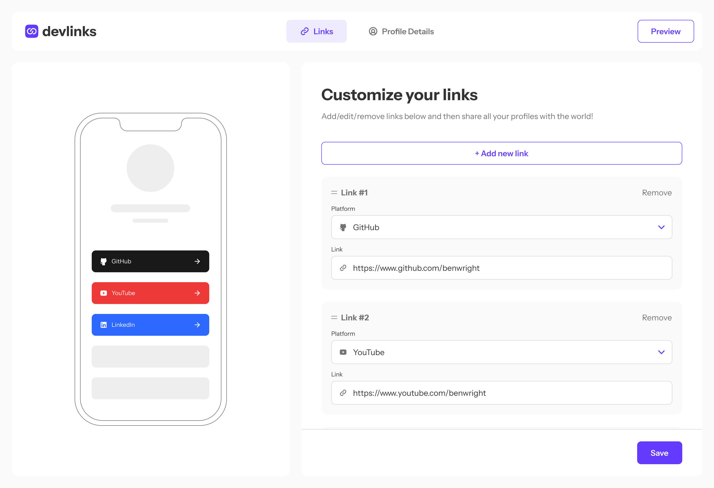

# Developer Link Sharing App

A modern, full-stack link sharing platform for developers. Create a personalized profile with all your social links, then share it with a single URL.



## ✨ Features

- **🔗 Centralized Links** - Add all your social profiles and portfolio in one place
- **🖱️ Drag & Drop** - Reorder your links with intuitive drag-and-drop functionality
- **👤 Custom Profiles** - Create a unique, shareable profile page
- **🔐 Secure Authentication** - Sign up with social accounts or email
- **🎨 Beautiful UI** - Clean, modern interface with responsive design
- **⚡ Fast & Reliable** - Built with Next.js for optimal performance
- **🖼️ Profile Images** - Upload and manage your profile picture with Cloudinary
- **📱 Mobile Responsive** - Perfect experience across all devices

## 🛠️ Tech Stack

- **Frontend Framework:** [Next.js 16](https://nextjs.org/) - React framework for production
- **Database:** [MongoDB](https://www.mongodb.com/) - NoSQL database
- **ODM:** [Mongoose](https://mongoosejs.com/) - MongoDB object modeling
- **Authentication:** [Clerk](https://clerk.dev/) - Complete user management
- **UI Components:** [shadcn/ui](https://ui.shadcn.com/) - Re-usable component library
- **Styling:** [Tailwind CSS](https://tailwindcss.com/) - Utility-first CSS framework
- **Drag & Drop:** [@dnd-kit](https://dndkit.com/) - Modern drag and drop toolkit
- **State Management:** [Zustand](https://zustand-demo.pmnd.rs/) - Lightweight state management
- **Form Management:** [React Hook Form](https://react-hook-form.com/) + [Zod](https://zod.dev/) - Type-safe form validation
- **Image Upload:** [Cloudinary](https://cloudinary.com/) - Cloud-based image management

## 🚀 Getting Started

### Prerequisites

- Node.js 18+ and npm/yarn/pnpm
- MongoDB database (local or [MongoDB Atlas](https://www.mongodb.com/cloud/atlas))
- A Clerk account ([sign up here](https://clerk.dev/))
- A Cloudinary account ([sign up here](https://cloudinary.com/))

### Installation

1. **Clone the repository**

```bash
git clone https://github.com/iykekelvins/link-sharing-app.git
cd link-sharing-app
```

2. **Install dependencies**

```bash
npm install
# or
yarn install
# or
pnpm install
```

3. **Set up environment variables**

   Create a `.env.local` file in the root directory:

```env
# MongoDB
MONGODB_URI=

NEXT_PUBLIC_CLERK_SIGN_IN_FALLBACK_REDIRECT_URL=/
NEXT_PUBLIC_CLERK_SIGN_UP_FALLBACK_REDIRECT_URL=/

# Clerk
NEXT_PUBLIC_CLERK_PUBLISHABLE_KEY=
CLERK_SECRET_KEY=
NEXT_PUBLIC_CLERK_SIGN_IN_URL=/sign-in
NEXT_PUBLIC_CLERK_SIGN_IN_FALLBACK_REDIRECT_URL=/
NEXT_PUBLIC_CLERK_SIGN_UP_FALLBACK_REDIRECT_URL=/

# Cloudinary
NEXT_PUBLIC_CLOUDINARY_CLOUD_NAME=
CLOUDINARY_API_KEY=
CLOUDINARY_API_SECRET=
```

4. **Run the development server**

```bash
npm run dev
# or
yarn dev
# or
pnpm dev
```

5. **Open your browser**

   Navigate to [http://localhost:3000](http://localhost:3000)

## 📁 Project Structure

```
link-sharing-app/
├── app/                 # Next.js app directory
│   ├── (auth)/          # Authentication routes
│   ├── (main)/          # Links routes
│   ├── [username]/      # Public profile routes
│   └── layout.tsx       # Root layout
├── components/          # React components
│   ├── ui/              # shadcn/ui components
│   └── ...              # Other components
├── lib/                 # Utility functions
│   ├── db.ts            # MongoDB connection
│   └── utils.ts         # Helper functions
├── models/              # Mongoose models
│   ├── User.ts          # User model
│   └── Link.ts          # Link model
├── store/               # Zustand stores
│   └── useUserStore.ts  # Global state
│   └── useLinkStore.ts  # Links state
└── public/              # Static assets
```

## 🎯 Key Features Explained

### Profile Management

- Create a personalized profile with username and bio
- Upload profile images via Cloudinary
- Customize your public profile URL (e.g., `/yourusername`)
- Edit profile information anytime

### Link Management

- Add unlimited social links and project URLs
- Organize links by platform (GitHub, LinkedIn, Twitter, Portfolio, etc.)
- Drag and drop to reorder links based on priority
- Edit or delete links with ease
- Preview how your profile looks to visitors

### Authentication

- Sign up with email or social providers (Google, GitHub, etc.)
- Secure authentication managed by Clerk
- Protected dashboard and profile editing routes
- Seamless sign-in/sign-up experience

### Drag & Drop

- Intuitive drag handle on each link card
- Visual feedback during reordering
- Optimistic updates for instant feedback
- Touch-friendly for mobile devices

## 🔒 Security

- User authentication managed by Clerk
- All database operations validated with Zod schemas
- Users can only access and modify their own profiles and links
- Secure API endpoints with middleware protection
- Environment variables for sensitive credentials

## 🎨 Customization

### Adding New Link Platforms

Extend the platform options in your form schema to include custom platforms or social networks.

### Theming

The app uses shadcn/ui components. Modify the Tailwind configuration and CSS variables to customize colors and styles.

## 📝 Database Schema

### Users

```typescript
{
  clerkId: String (unique),
  email: String (required),
  username: String (unique),
  firstName: String,
  lastName: String,
  image_url: String,
  createdAt: Date,
  updatedAt: Date
}
```

### Links

```typescript
{
  userClerkId: string
  id: string
  platform: String (required),
  url: String (required),
  createdAt: Date,
  updatedAt: Date
}
```

## 🙏 Acknowledgments

- [Next.js Documentation](https://nextjs.org/docs)
- [MongoDB Documentation](https://docs.mongodb.com/)
- [Clerk Documentation](https://clerk.com/docs)
- [shadcn/ui](https://ui.shadcn.com/)
- [dnd-kit](https://dndkit.com/)
- [Cloudinary](https://cloudinary.com/documentation)

## 📧 Contact

Your Name - [@iykekelvins](https://x.com/iykekelvins) - kelvinochubili@gmail.com

Project Link: [https://github.com/iykekelvins/link-sharing-app](https://github.com/iykekelvins/link-sharing-app)

---

Made with ❤️ using Next.js and MongoDB
